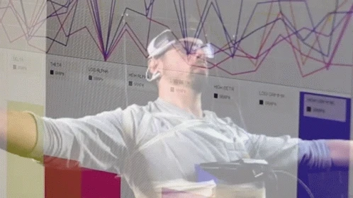
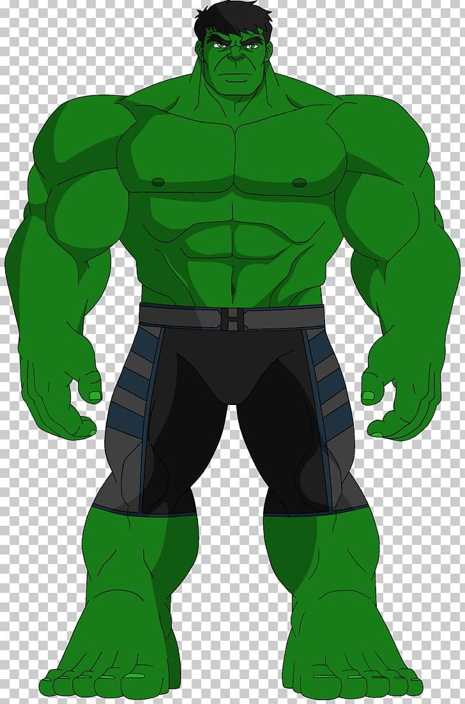

  
  
  <h1>SuperTraid</h1>
  <h3>AI-Driven Algorithmic Trading and Statistical Arbitrage Platform</h3>

  

    <strong>Smart · Predictive · Data-Driven</strong> 
    Combining <b>Machine Learning</b> and <b>Statistical Arbitrage</b> for intelligent trading decisions.
  

  
  
  

 

<h2>Introduction</h2>

  Financial markets generate massive amounts of data every second, making it increasingly difficult for traders to identify profitable opportunities manually.
  Traditional trading strategies often rely on fixed rules or human intuition, both of which fail to adapt quickly to changing market dynamics.
    
  The need for intelligent, automated systems that can learn from patterns, adapt to volatility, and make statistically sound trading decisions has never been greater.

 

<h2>💡 Our Solution</h2>

  <b>SuperTraid</b> is an <b>AI-driven algorithmic trading platform</b> that fuses 
  <b>statistical arbitrage</b> techniques with <b>machine learning</b> predictions to build smart trading strategies. 
  It helps users discover, backtest, and simulate profitable opportunities using real market data — all through an intuitive dashboard.

  

  Our platform focuses on:
  <ul>
    <li>📊 <b>Statistical Arbitrage</b> – finding cointegrated stock pairs and trading based on mean reversion.</li>
    <li>🧠 <b>Machine Learning</b> – predicting next-day price trends and volatility patterns.</li>
    <li>⚙️ <b>Unified Backtesting Engine</b> – comparing multiple strategies under realistic market conditions.</li>
    <li>📈 <b>Visual Dashboard</b> – clear performance insights through real-time charts and analytics.</li>
  </ul>

 

<h2>🧰 Tech Stack</h2>

<table align="center">
  <tr>
    <td align="center" width="120">
       React
    </td>
    <td align="center" width="120">
       Node.js
    </td>
    <td align="center" width="120">
       Express
    </td>
    <td align="center" width="120">
       MongoDB
    </td>
    <td align="center" width="120">
       PostgreSQL
    </td>
    <td align="center" width="120">
       Python
    </td>
  </tr>
  <tr>
    <td align="center" width="120">
       JavaScript
    </td>
    <td align="center" width="120">
       Chart.js
    </td>
    <td align="center" width="120">
       Git
    </td>
    <td align="center" width="120">
       Docker
    </td>
    <td align="center" width="120">
       FastAPI
    </td>
    <td align="center" width="120">
       HTML5
    </td>
  </tr>
</table>

 

<h2>🧭 Project Status</h2>

  
    
  
<i>SuperTraid is currently under active development — stay tuned for upcoming modules and live deployment.</i>

  

  

  
🚀 <b>SuperTraid</b> | Developed by a passionate team of engineers blending AI and Finance.

<h2 align="center">👩‍💻 Team SuperTraid</h2>

  <i>Meet the developers behind SuperTraid — a fusion of data, AI, and a little bit of comic energy 💥</i>

  <!-- Kajal -->
  <a href="https://github.com/Kajallchauhan" target="_blank" style="margin: 20px;">
     
    <b>Kajal Vivek Singh Chauhan</b> 
    💻 <i>@Kajallchauhan</i>
  </a>

  <!-- Jeevan -->
  <a href="https://github.com/JeevanC37" target="_blank" style="margin: 20px;">
     
    <b>Jeevan C</b> 
    🧱 <i>@JeevanC37</i>
  </a>

  <!-- Jatin -->
  <a href="https://github.com/JatinS0241" target="_blank" style="margin: 20px;">
     
    <b>Jatin Saraogi</b> 
    💪 <i>@JatinS0241</i>
  </a>

  <!-- Ryan -->
  <a href="https://github.com/RyanRoy37" target="_blank" style="margin: 20px;">
     
    <b>Ryan Roy</b> 
    ⚡ <i>@RyanRoy37</i>
  </a>

 

